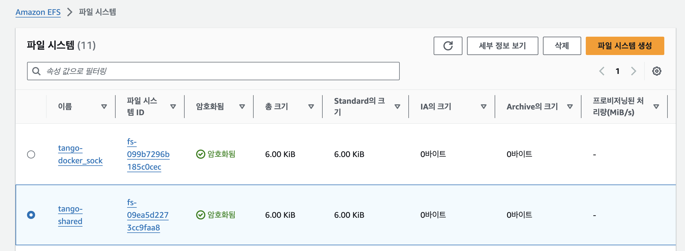
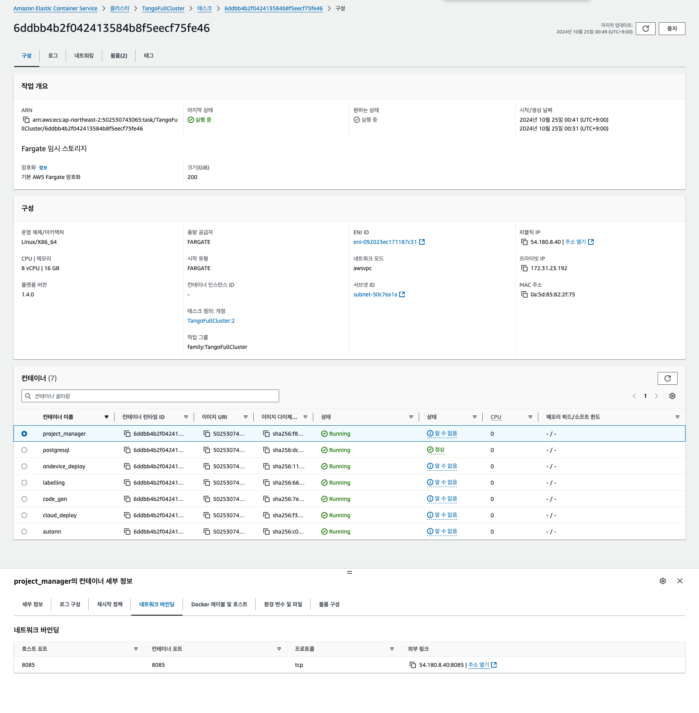
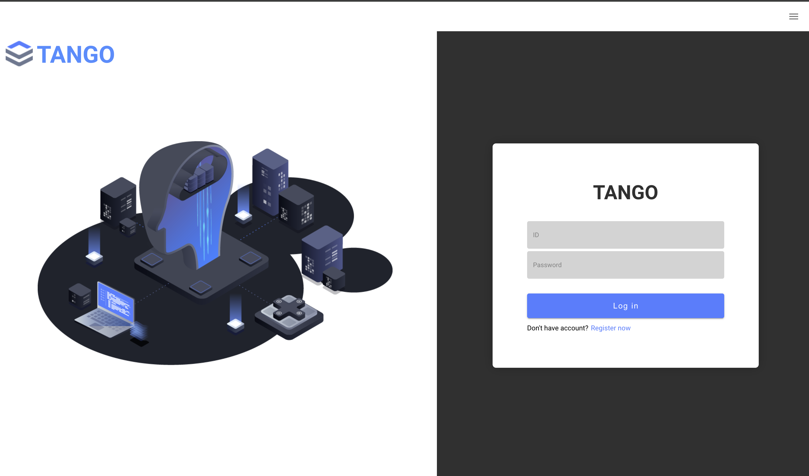
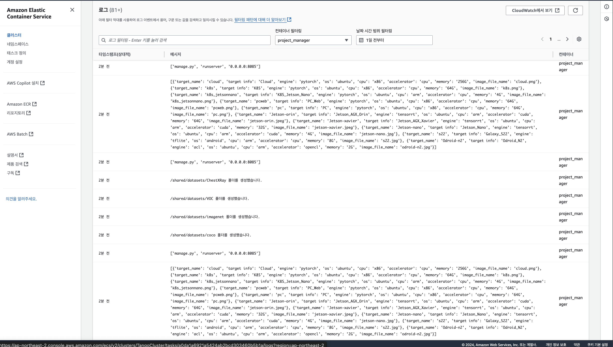

# TASS의 AWS ECS Fargate 실행 설정


## AWS ECR 도커 컨테이너 등록 

AWS ECR 도커 등록 하기 전에 

### TANGO Repository 다운로드 후 Docker 빌드

* TANGO Repository 가져오기
```shell
git clone https://github.com/ML-TANGO/TANGO.git
```

* Docker compose 빌드
```shell
$ cd TANGO
$ sudo docker compose up -d --build
```


```shell
docker images
REPOSITORY                                                         TAG       IMAGE ID       CREATED             SIZE
tango-code_gen                                                     latest    1d06553a9739   25 minutes ago      23GB
tango-labelling                                                    latest    7c2791685b50   50 minutes ago      11.2GB
tango-autonn                                                       latest    c84c673f79fb   56 minutes ago      27.8GB
tango-project_manager                                              latest    05bf89d51bf9   About an hour ago   1.95GB
tango-cloud_deploy                                                 latest    2ba4181e49fd   About an hour ago   1.39GB
tango-ondevice_deploy                                              latest    c45be5ea2c1f   About an hour ago   978MB
postgres                                                           15.4      68a92c148701   15 months ago       411MB
```


* 태그 생성
  ```shell
  $ docker tag tango-autonn:latest  xxxxxxxxxxxxxx.dkr.ecr.ap-northeast-2.amazonaws.com/tango-autonn:latest
  $ docker tag tango-cloud_deploy:latest xxxxxxxxxxxxxx.dkr.ecr.ap-northeast-2.amazonaws.com/tango-cloud_deploy:latest
  $ docker tag tango-code_gen:latest xxxxxxxxxxxxxx.dkr.ecr.ap-northeast-2.amazonaws.com/tango-code_gen:latest
  $ docker tag tango-labelling:latest xxxxxxxxxxxxxx.dkr.ecr.ap-northeast-2.amazonaws.com/tango-labelling:latest
  $ docker tag tango-ondevice_deploy:latest  xxxxxxxxxxxxxx.dkr.ecr.ap-northeast-2.amazonaws.com/tango-ondevice_deploy:latest
  $ docker tag postgres:15.4  xxxxxxxxxxxxxx.dkr.ecr.ap-northeast-2.amazonaws.com/tango-postgres:15.4
  $ docker tag tango-project_manager:latest  xxxxxxxxxxxxxx.dkr.ecr.ap-northeast-2.amazonaws.com/tango-project_manager:latest
  ```

* AWS ECR 로그인
```shell
 aws ecr get-login-password --region ap-northeast-2 | docker login --username AWS --password-stdin xxxxxxxxxxxxxx.dkr.ecr.ap-northeast-2.amazonaws.com/tango
```
  

* AWS ECR에 빌드한 Docker 컨테이너 푸시
  ```shell
  $ docker push xxxxxxxxxxxxxx.dkr.ecr.ap-northeast-2.amazonaws.com/tango-autonn:latest
  $ docker push xxxxxxxxxxxxxx.dkr.ecr.ap-northeast-2.amazonaws.com/tango-cloud_deploy:latest
  $ docker push xxxxxxxxxxxxxx.dkr.ecr.ap-northeast-2.amazonaws.com/tango-code_gen:latest
  $ docker push xxxxxxxxxxxxxx.dkr.ecr.ap-northeast-2.amazonaws.com/tango-labelling:latest 
  $ docker push xxxxxxxxxxxxxx.dkr.ecr.ap-northeast-2.amazonaws.com/tango-ondevice_deploy:latest
  $ docker push xxxxxxxxxxxxxx.dkr.ecr.ap-northeast-2.amazonaws.com/tango-postgres:15.4
  $ docker push xxxxxxxxxxxxxx.dkr.ecr.ap-northeast-2.amazonaws.com/tango-project_manager:latest
  ```


  ## AWS EFS 파일시스템 생성

  


  ## AWS ECS의 FARGATE로 TANGO 프로젝트 배포 결과 
* AWS ECS의 FARGATE로 배포 성공 화면


* project_manager 실행 결과 화면
 

* 실행 로그 확인 
 