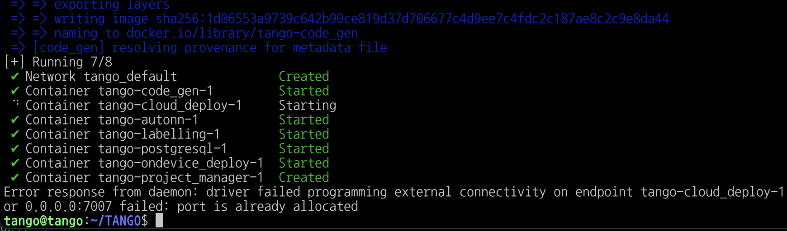
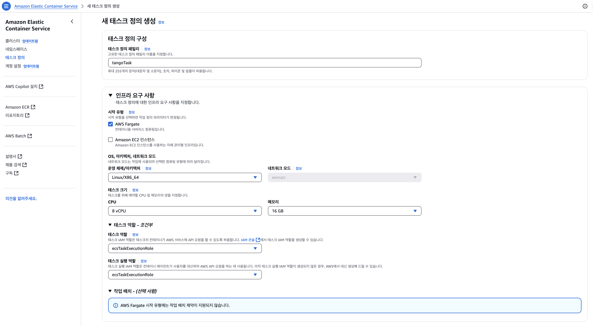
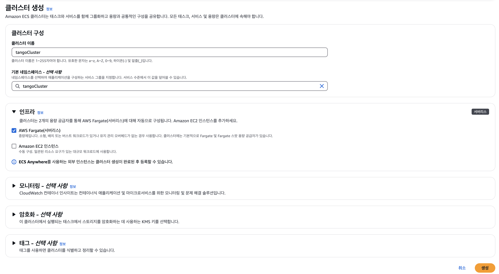
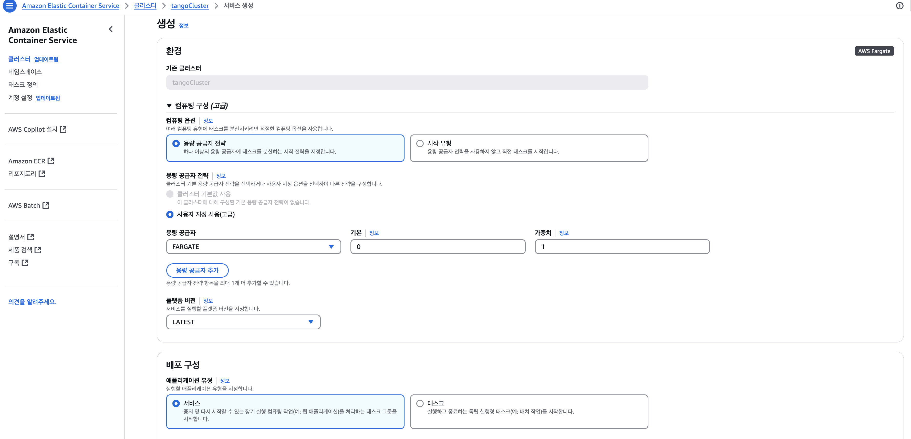

# TASS의 AWS ECS Fargate 실행 설정


### TANGO Repository 다운로드 후 Docker 빌드

* TANGO Repository 가져오기
```shell
git clone https://github.com/ML-TANGO/TANGO.git
```


AWS ECR 도커 등록 및 AWS ECS의 FARGATE에 배포하기전에, 소스코드 상의 hostname을 localhost 혹은 127.0.0.1로 바꿔야 합니다.
그리고, host와 container의 port를 똑같이 맞춰야 합니다

참고 링크: 
[Task Networking in AWS Fargate](https://aws.amazon.com/ko/blogs/compute/task-networking-in-aws-fargate/)

변경 전.
```shell
        "/api": { target: "http://localhost:10236", proxyTimeout: 5 * 60 * 1000, timeout: 5 * 60 * 1000 },
        "/qithum": "http://localhost:10236",
        "/static": "http://localhost:10236",
```
변경 후.
```shell
        "/api": { target: "http://localhost:8095", proxyTimeout: 5 * 60 * 1000, timeout: 5 * 60 * 1000 },
        "/qithum": "http://localhost:8095",
        "/static": "http://localhost:8095",
```


* Docker compose 빌드
```shell
$ cd TANGO
$ sudo docker compose up -d --build
```



## AWS ECR 도커 컨테이너 등록
Docker compose 로 빌드된 컨테이너를, AWS ECR 컨테이너에 등록합니다 .

다음에는 AWS ECR에 7개의 컨테이너 이름를 등록하였습니다.
* tango-autonn
* tango-cloud_deploy
* tango-code_gen
* tango-labelling
* tango-ondevice_deploy
* tango-postgres
* tango-project_manager

이후 빌드 완료된 컨테이너에 대해서 태그를 붙입니다 
```shell
docker images
REPOSITORY                                                         TAG       IMAGE ID       CREATED             SIZE
tango-code_gen                                                     latest    1d06553a9739   25 minutes ago      23GB
tango-labelling                                                    latest    7c2791685b50   50 minutes ago      11.2GB
tango-autonn                                                       latest    c84c673f79fb   56 minutes ago      27.8GB
tango-project_manager                                              latest    05bf89d51bf9   About an hour ago   1.95GB
tango-cloud_deploy                                                 latest    2ba4181e49fd   About an hour ago   1.39GB
tango-ondevice_deploy                                              latest    c45be5ea2c1f   About an hour ago   978MB
postgres                                                           15.4      68a92c148701   15 months ago       411MB
```

* tango-autonn  -> tango-autonn
* tango-cloud_deploy -> tango-cloud_deploy
* tango-code_gen -> tango-code_gen
* tango-labelling -> tango-labelling
* tango-ondevice_deploy -> tango-ondevice_deploy
* postgres -> tango-postgres
* tango-project_manager -> tango-project_manager


생성한 AWS ECR 컨테이너를 푸시 하기 위해서 태그를 생성합니다.
* 태그 생성
  ```shell
  $ docker tag tango-autonn:latest  xxxxxxxxxxxxxx.dkr.ecr.ap-northeast-2.amazonaws.com/tango-autonn:latest
  $ docker tag tango-cloud_deploy:latest xxxxxxxxxxxxxx.dkr.ecr.ap-northeast-2.amazonaws.com/tango-cloud_deploy:latest
  $ docker tag tango-code_gen:latest xxxxxxxxxxxxxx.dkr.ecr.ap-northeast-2.amazonaws.com/tango-code_gen:latest
  $ docker tag tango-labelling:latest xxxxxxxxxxxxxx.dkr.ecr.ap-northeast-2.amazonaws.com/tango-labelling:latest
  $ docker tag tango-ondevice_deploy:latest  xxxxxxxxxxxxxx.dkr.ecr.ap-northeast-2.amazonaws.com/tango-ondevice_deploy:latest
  $ docker tag postgres:15.4  xxxxxxxxxxxxxx.dkr.ecr.ap-northeast-2.amazonaws.com/tango-postgres:15.4
  $ docker tag tango-project_manager:latest  xxxxxxxxxxxxxx.dkr.ecr.ap-northeast-2.amazonaws.com/tango-project_manager:latest
  ```

* AWS ECR 로그인
```shell
 aws ecr get-login-password --region ap-northeast-2 | docker login --username AWS --password-stdin xxxxxxxxxxxxxx.dkr.ecr.ap-northeast-2.amazonaws.com/tango
```
  
* AWS ECR에 빌드한 Docker 컨테이너 푸시
  ```shell
  $ docker push xxxxxxxxxxxxxx.dkr.ecr.ap-northeast-2.amazonaws.com/tango-autonn:latest
  $ docker push xxxxxxxxxxxxxx.dkr.ecr.ap-northeast-2.amazonaws.com/tango-cloud_deploy:latest
  $ docker push xxxxxxxxxxxxxx.dkr.ecr.ap-northeast-2.amazonaws.com/tango-code_gen:latest
  $ docker push xxxxxxxxxxxxxx.dkr.ecr.ap-northeast-2.amazonaws.com/tango-labelling:latest 
  $ docker push xxxxxxxxxxxxxx.dkr.ecr.ap-northeast-2.amazonaws.com/tango-ondevice_deploy:latest
  $ docker push xxxxxxxxxxxxxx.dkr.ecr.ap-northeast-2.amazonaws.com/tango-postgres:15.4
  $ docker push xxxxxxxxxxxxxx.dkr.ecr.ap-northeast-2.amazonaws.com/tango-project_manager:latest
  ```


## AWS EFS 파일시스템 생성
  AWS ECS FARGATE에 배포를 하기 위해서 AWS EFS 파일시스템 2개를 생성합니다. 여기서는 다음의 링크로 설정했습니다
   * tango-docker_sock
   * tango-shared

  


## AWS ECS의 FARGATE로 배포
AWS ECS 화면에서 태스크 정의를 합니다.


세부 내역에 대해서는 Tango의 docker compose yaml 파일
[docker-compose.yml](https://github.com/ML-TANGO/TANGO/blob/main/docker-compose.yml) 의 내용을 바탕으로 채워넣으면 됩니다.

배포할때의 상세 내용은 다음의 샘플 링크 [sample_ecs_fargate.json](./sample_ecs_fargate.json)를 통해 확인 할 수 있습니다.

그리고 TANGO의 태스크 정의할때 임시 스토리지 량을 200GB를 설정해야 AWS Fargate에서 제대로 배포할 수 있습니다. 


이후, 클러스터를 생성합니다.


클러스터 생성후에는, 서비스를 생성하면 배포가 됩니다.


## AWS ECS의 FARGATE로 TANGO 프로젝트 배포 결과 
* AWS ECS의 FARGATE로 배포 성공 화면


* project_manager 실행 결과 화면
 

* 실행 로그 확인 
 